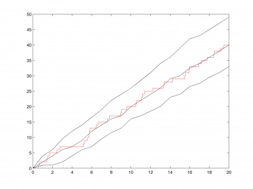

[](http://quantlet.de/)

## [](http://quantlet.de/) **quantilelines** [](http://quantlet.de/)

```yaml

Name of QuantLet: quantilelines

Published in: Statistical Tools for Finance and Insurance

Description: 'Computes quantiles of trajectories and plots quantiles and median of a trajectory of a homogeneous poisson process.'

Keywords: risk process, risk, quantile, plot, visualization, median, descriptive, Poisson process

See also: STFcat02, simHPP, simNHPP, simNHPPALP

Author: Awdesch Melzer

Submitted: Tue, August 06 2013 by Awdesch Melzer

Input: 'step: scalar, time interval between points at which the quantiles are computed
        data: n x m x 2 array, data, where n is the length of trajectories and m the number of trajectories
        perc: s x 1 vector, orders of quantiles'

Output: 'y: p x q matrix, where first column contains time and the remaining quantiles'

Example: 'y = quantilelines(data,step,perc)
          RandStream.setGlobalStream(RandStream("mt19937ar","seed",99));
          y = simHPP(2,20,100);
          q = quantilelines(y,1,[0.1,0.5,0.9]);
          plot(q(:,1),q(:,2),"k-")
          hold on
          plot(q(:,1),q(:,3),"k-")
          plot(q(:,1),q(:,4),"k-")
          plot(y(:,1,1),y(:,1,2),"r-")'

```



### MATLAB Code
```matlab

function [y] = quantilelines(data,step,perc)
if (size(step,1)~=1||step<=0)
  error('quantiles: step must be a positive scalar.');
end
if (size(perc,2)~=1||size(perc,1)==1)
  error('quantiles: perc must be n x 1 vector.');
end

  if(exist('perc')==0)
    perc =(1:9)/10;
  end
  N = size(data,2);
  R = size(data,1);
  begin  = data(1,1,1);
  theend = data(R,1,1);
  numofpoints = (theend-begin)/step+1;
  last        = begin+(numofpoints-1)*step;
  vecstep     = (begin:step:last)';
  y           = zeros(1,size(perc,1));
  i = 1;
  while(i<=numofpoints)
    j = 1;
    vecval = 0;
    while(j<=N)
      aux1 = data(:,j,1);
      aux2 = data(:,j,2);
      pos  = sum(aux1<=vecstep(i));
      if(pos<R)
        vecval=[vecval;aux2(pos)+(vecstep(i)-aux1(pos))*(aux2(pos+1)-aux2(pos))/(aux1(pos+1)-aux1(pos))];
      else
        vecval=[vecval;aux2(pos)];
      end
      j = j + 1;
    end
    y = [y;(quantile(vecval(2:N+1),perc))'];
    i = i + 1;
  end
  y = [vecstep,y(2:numofpoints+1,:)];
end


```

automatically created on 2018-05-28