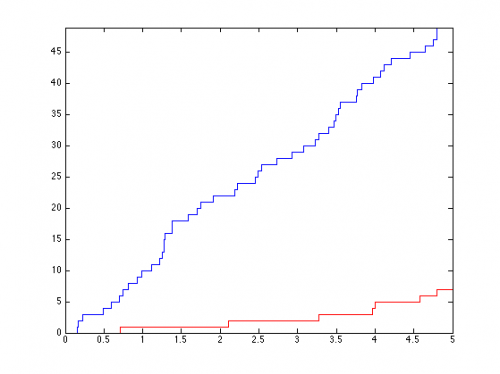

[](http://quantlet.de/)

## [](http://quantlet.de/) **simHPP_** [](http://quantlet.de/)

```yaml

Name of QuantLet: simHPP_

Published in: Statistical Tools for Finance and Insurance

Description: 'Generates and plots an homogeneous Poisson process with an intensity lambda.'

Keywords: Poisson process, risk process, poisson, plot, visualization, graphical representation

See also: 'BondCoupon, BondCoupon, BondOnlyCoupon, BondOnlyCoupon, BondZeroCoupon, BondZeroCouponHPP, BondZeroCouponHPP, STFcat02, STFcat04, STFcat04, STFcat05, STFcat05, STFcat06, STFcat06, STFcat07, STFcat07, STFcat08, STFcat08, STFcat09, STFcat09, quantilelines, simHPPALP, simHPPALP, simNHPP, simNHPP, simNHPPALP, simNHPPALP'

Author: Awdesch Melzer

Submitted: Tue, August 06 2013 by Awdesch Melzer

Input: 'lambda: scalar, intensity of the Poisson process
        T: scalar, time horizon
        N: scalar, number of trajectories'

Output: 'y: (2*max+2) x N x 2 array, generated process: max is the maximum number of jumps for all generated trajectories'

Example: 'Show two trajectories of homogeneous Poisson process: y = simHPP(lambda,T,N)
          R:
          y1 = simHPP(3,5,1)
          y2 = simHPP(10,5,1) 
          plot(y1[,,1],y1[,,2],type="l",col="red3",ylim=c(min(y1[,,2],y2[,,2]),max(y1[,,2],y2[,,2])),ylab="",xlab="") 
          lines(y2[,,1],y2[,,2],type="l",col="blue3")
          MatLab:
          y1 = simHPP(3,5,1);
          y2 = simHPP(10,5,1);
          plot(y1(:,:,1),y1(:,:,2),"r-")
          ylim([min(min(y1(:,:,2)),min(y2(:,:,2))),max(max(y1(:,:,2)),max(y2(:,:,2)))])
          line(y2(:,:,1),y2(:,:,2))'

```




### R Code
```r

simHPP = function(lambda,T,N){
 if(lambda <= 0 || length(lambda)!=1){
 	stop("simHPP: Lambda must be a positive scalar.")
 }
 if(T <= 0 || length(T)!=1){
 	stop("simHPP: T must be a positive scalar.")
 }
 if(N <= 0 || length(N)!=1){
 	stop("simHPP: N must be a positive scalar.")
 }
  EN      = rpois(N,lambda*T)
  ym      = matrix(T,2*max(EN)+2,N)
  tmp     = array(0,c(2*max(EN)+2,N,2))
  y       = tmp
  y[,,1] = ym
  y[,,2] = matrix(1,2*max(EN)+2,1)%*%t(EN)

  i=1
  while(i<=N){
    if(EN[i]>0){
    	ttmp = c(sort(T*runif(EN[i])))
    	y[1:(2*EN[i]+1),i,1] = c(0,ttmp[ceiling((1:(2*EN[i]))/2)])
    }else{
        y[1,i,1]             = 0
    }
    y[1:(2*EN[i]+2),i,2] = c(0,floor((1:(2*EN[i]))/2),EN[i])
    i=i+1
  }
return(y)

}
```

automatically created on 2018-05-28

### MATLAB Code
```matlab


function [y] = simHPP(lambda,T,N)
 if(lambda <= 0 || length(lambda)~=1)
 	error('simHPP: Lambda must be a positive scalar.');
 end
 if(T <= 0 || length(T)~=1)
 	error('simHPP: T must be a positive scalar.');
 end
 if(N <= 0 || length(N)~=1)
 	error('simHPP: N must be a positive scalar.');
 end
  EN       = poissrnd(lambda*T,N,1);
  ym       = T*ones(2*max(EN)+2,N);
  tmp      = zeros(2*max(EN)+2,N,2);
  y        = tmp;
  y(:,:,1) = ym;
  y(:,:,2) = ones(2*max(EN)+2,1)*EN';

  i=1;
  while(i<=N)
    if(EN(i)>0)
    	ttmp = sort(T*unifrnd(0,1,EN(i),1));
    	y(1:(2*EN(i)+1),i,1) = [0;ttmp(ceil((1:(2*EN(i)))/2))];
    else
        y(1,i,1)             = 0;
    end
    y(1:(2*EN(i)+2),i,2) = [0;floor((1:(2*EN(i)))/2)';EN(i)];
    i=i+1;
  end


end
```

automatically created on 2018-05-28