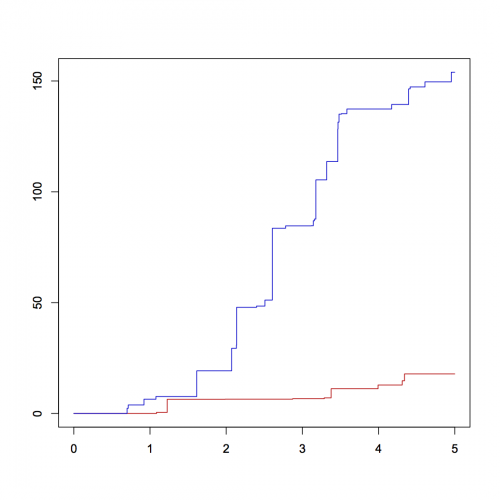

[](http://quantlet.de/)

## [](http://quantlet.de/) **simNHPPALP** [](http://quantlet.de/)

```yaml

Name of QuantLet: simNHPPALP

Published in: Statistical Tools for Finance and Insurance

Description: 'Generates and plots the aggregate loss process driven by the non-homogeneous Poisson process.'

Keywords: poisson, Poisson process, risk, poisson, stochastic-process, stochastic

See also: 'BondCoupon, BondCoupon, BondOnlyCoupon, BondOnlyCoupon, BondZeroCoupon, Burrrnd, Paretornd, STFcat02, STFcat04, STFcat04, STFcat05, STFcat05, STFcat06, STFcat06, STFcat07, STFcat07, STFcat08, STFcat08, STFcat09, STFcat09, mixexprnd, quantilelines, simHPP, simHPPALP, simNHPP'

Author: Awdesch Melzer

Submitted: Tue, August 06 2013 by Awdesch Melzer

Input: 'parlambda: n x 1 vector, parameters of the intensity function lambda (n=2 for lambda=1, n=3 otherwise)
        N: scalar, number of trajectories
        params: n x 1 vector, parameters of the claim size distribution
        n = 1 (exponential)
        n = 2 (gamma, lognormal, Pareto, Weibull)
        n = 3 (Burr, mixofexps)
        T- scalar, time horizon
        distrib: string, claim size distribution:
        "Burr": Burr distribution
        "exponential": exponential distribution
        "gamma": gamma distribution
        "lognormal": lognormal distribution
        "mixofexps": mix of exponential distributions
        "Pareto": Pareto distribution
        "Weibull": Weibull distribution
        lambda: scalar, intensity function, sine function (lambda=0) linear function (lambda=1) or sine square function (lambda=2)'

Output: 'y: (2*max+2) x N x 2 array, generated process: max is the maximum number of jumps for all generated trajectories'

Example: 'Show two trajectories of aggregate loss process driven by the non-homogeneous Poisson process: y = simNHPPALP(lambda,parlambda,distrib,params,T,N)
          R:
          y1 = simNHPPALP(0,c(1,1,0),"Burr",c(3,2,1),5,1)
          y2 = simNHPPALP(1,c(1,1),"Pareto",c(1.5,2.5),5,1) plot(y1[,1],y1[,2],type="l",col="red3"
          ylim=c(min(y1[,2],y2[,2]),max(y1[,2],y2[,2])),ylab="",xlab="")
          lines(y2[,1],y2[,2],type="l",col="blue3")
          MatLab: 
          y1 = simNHPPALP(0,[1,1,0],"Burr",[3,2,1],5,1);
          y2 = simNHPPALP(1,[1,1],"Pareto",[1.5,2.5],5,1);
          plot(y1(:,:,1),y1(:,:,2),"r-")
          ylim([min(min(y1(:,:,2)),min(y2(:,:,2))),max(max(y1(:,:,2)),max(y2(:,:,2)))])
          line(y2(:,:,1),y2(:,:,2))'

```




### R Code
```r


########################## SUBROUTINES ##########################

Burrrnd = function(alpha,lambda,tau,n,m){
#BURRRND Random arrays from Burr distribution.
#   R = BURRRND(ALPHA,LAMBDA,TAU,N,M) returns an M-by-N array of random numbers 
#   chosen from the Burr distribution with parameters ALPHA, LAMBDA, TAU.
#
#   The default values for the parameters ALPHA, LAMBDA, TAU, M, N are
#   1, 1, 2, 1, 1, respectively.
#
#   BURRRND uses the inversion method.


  if (missing(m)){
    m      = 1
  }
  if (missing(n)){
    n      = 1
  }
  if (missing(tau)){
    tau    = 2
  }
  if (missing(lambda)){
    lambda = 1
  }
  if (missing(alpha)){
    alpha  = 1
  }
   u = matrix(0,n,m)
   for (i in 1:m){
   	   u[,i] = (lambda*(runif(n,0,1)^(-1/alpha)-1))^(1/tau)
   }
   y = u
return(y)
}

mixexprnd = function(p,beta1,beta2,n,m){
#MIXEXPRND Random arrays from the mixed exponential distribution.
#   Y = MIXEXPRND(P,BETA1,BETA2,N,M) returns an M-by-N array of random numbers 
#   chosen from the mixed exponential distribution with parameters P, BETA1, BETA2.
#
#   The default values for A, BETA1, BETA2, N, M are 0.5, 1, 2, 1, 1,
#   respectively.
#
#   MIXEXPRND uses the exponential number generator.

  if (missing(p)){
      p     = 0.5
  }
  if (missing(beta1)){
      beta1 = 1
  }
  if (missing(beta2)){
      beta2 = 2
  }
  y   = rexp(n*m,rate=(1/beta2))
  aux = which(runif(n*m,0,1)<=p)  

      if(!missing(aux)){
          y[aux]=rexp(length(aux),1/beta1)
      }

  y=matrix(y,n,m);
  return(y)
  }

simHPP = function(lambda,T,N){
# SIMHPP Homogeneous Poisson process.
#       Y = SIMHPP(lambda,T,N) generates N trajectories of the
#       homogeneous Poisson process with intensity LAMBDA. T is the time
#       horizon. 

if(lambda <= 0 || length(lambda)!=1){
 	stop("simHPP: Lambda must be a positive scalar.")
 }
 if(T <= 0 || length(T)!=1){
 	stop("simHPP: T must be a positive scalar.")
 }
 if(N <= 0 || length(N)!=1){
 	stop("simHPP: N must be a positive scalar.")
 }
  EN      = rpois(N,lambda*T)
  ym      = matrix(T,2*max(EN)+2,N)
  tmp     = array(0,c(2*max(EN)+2,N,2))
  y       = tmp
  y[,,1] = ym
  y[,,2] = matrix(1,2*max(EN)+2,1)%*%t(EN)

  i=1
  while(i<=N){
    if(EN[i]>0){
    	ttmp = c(sort(T*runif(EN[i])))
    	y[1:(2*EN[i]+1),i,1] = c(0,ttmp[ceiling((1:(2*EN[i]))/2)])
    }else{
        y[1,i,1]             = 0
    }
    y[1:(2*EN[i]+2),i,2] = c(0,floor((1:(2*EN[i]))/2),EN[i])
    i=i+1
  }
return(y)
}


simNHPP = function(lambda,parlambda,T,N){
  	
    # SIMNHPP Non-homogeneous Poisson process.
    # ---------------------------------------------------------------------
    #       Y = SIMNHPP(lambda,parlambda,T,N) generates N trajectories of the
    #       non-homogeneous Poisson process with intensity specified by LAMBDA
    #       (0 - sine function, 1 - linear function, 2 - sine square function)
    #       with paramters in PARLAMBDA. T is the time horizon. The function
    #       usues thining method.
    # ---------------------------------------------------------------------
    
    a = parlambda[1]
    b = parlambda[2]
    if (lambda==0){
        d = parlambda[3]
        JM = simHPP(a+b,T,N)
    } else if(lambda==1){
        JM = simHPP(a+b*T,T,N)
    } else if (lambda==2){
        d = parlambda[3]
        JM = simHPP(a+b*T,T,N)
	}
	rjm = nrow(JM)
    yy = array(0,c(rjm,N,2))
    yy[,,1]= matrix(T,nrow=rjm,ncol=N)
    
    i=1
    maxEN=0
    while(i<=N){
        pom = JM[,i,1][JM[,i,1]<T]
        pom = pom[2*(1:(length(pom)/2))]
        R = runif(NROW(pom))
        if (lambda==0){
            lambdat = (a+b*sin(2*pi*(pom+d)))/(a+b)
        } else {
            if (lambda==1){
                lambdat = (a+b*pom)/(a+b*T)
            } else {
                if (lambda==2){
                    lambdat = (a+b*sin(2*pi*(pom+d))^2)/(a+b)
                }}}
        pom = pom[R<lambdat]
        EN = NROW(pom)
        maxEN = max(maxEN,EN)
        yy[1:(2*EN+1),i,1] = c(0,rep(pom,each=2))
        yy[2:(2*EN),i,2] = c(floor((1:(2*EN-1))/2))
        yy[(2*EN+1):rjm,i,2] = matrix(EN,nrow=rjm-2*EN,ncol=1)
        i=i+1
    }
    yy = yy[1:(2*maxEN+2),,]
    return(yy)
}


Paretornd = function(alpha,lambda,n,m){
#PARETORND Random arrays from Pareto distribution.
#   Y = PARETORND(ALPHA,LAMBDA,N,M) returns an M-by-N array of random numbers 
#   chosen from the Pareto distribution with parameters ALPHA, LAMBDA.
#
#   The default values for ALPHA, LAMBDA, N, M 1, 1, 1, 1, respectively.
#
#   PARETORND uses the inversion method.

  if (missing(m)){
    m      = 1
  }
  if (missing(n)){
    n      = 1
  }
  if (missing(lambda)){
    lambda = 1
  }
  if (missing(alpha)){
    alpha  = 1
  }
  u = matrix(0,n,m)
  for (i in 1:m){
  	u[,i] = lambda*(runif(n,0,1)^(-1/alpha)-1)
  }
  y = u
  return(y)
}

########################## MAIN PROGRAM ##########################

simNHPPALP = function(lambda,parlambda,distrib,params,T,N){
  
  if(lambda != 0 && lambda != 1 && lambda!=2){
  	stop("simNHPPALP: Lambda must be either 0,1 or 2.")
  }
  if(T <= 0 || (length(T))!=1){
  	stop("simNHPPALP: T must be a positive scalar.")
  }
  if(N <= 0 || (length(N))!=1){
  	stop("simNHPPALP: N must be a positive scalar.")
  }
  if(length(parlambda)!=3 && (lambda)!=1){
  	stop("simNHPPALP: for lambda 0 or 2, parlambda must be a 3 x 1 vector.")
  }
  if(length(parlambda)!=2 && (lambda)==1){
  	stop("simNHPPALP: for lambda 1, parlambda must be a 2 x 1 vector.")
  }
  if((distrib=="Burr" || distrib=="mixofexps") && (length(params))!=3){
  	stop("simNHPPALP: for Burr and mixofexps distributions, params must be a 3 x 1 vector.")
  }
  if((distrib=="gamma" || distrib=="lognormal"|| distrib=="Pareto" || distrib=="Weibull") && (length(params))!=2){
  	stop("simNHPPALP: for gamma, lognormal, Pareto and Weibull distributions, params must be a 2 x 1 vector.")
  }
  if(distrib=="exponential" && (length(params))!=1){
  	stop("simNHPPALP: for exponential distribution, params must be a scalar.")
  }
  if(distrib != "exponential" && distrib != "gamma" && distrib != "mixofexps" && distrib != "Weibull" && distrib != "lognormal" && distrib !="Pareto" && distrib != "Burr"){
  	stop("simNHPPALP: distribs should be: exponential, gamma, mixofexps, Weibull, lognormal, Pareto or Burr")
  }
  poisproc = simNHPP(lambda,parlambda,T,N)
  rpp      = dim(poisproc)[1]
  cpp      = dim(poisproc)[2]
  losses   = matrix(0,rpp,cpp)
  
  if (distrib=="Burr"){
    i = 1
    while(i<=N){
    	if(N==1){
            aux = min(as.matrix(which(poisproc[,1]==T))) #[1:i,])
        }else{
        	aux = min(as.matrix(which(poisproc[,i,1]==T))) #[1:i,])
        }
      if(aux>2){
        laux                  = cumsum(Burrrnd(params[1],params[2],params[3],aux/2-1,1))
        losses[3:aux,i]       = laux[ceiling((1:(aux-2))/2)]
        if(aux<rpp){
          losses[(aux+1):rpp,i] = matrix(laux[length(laux)],rpp-aux,1)
        }
      }else{
        losses[,i]=rep(0,rpp)
      }
      i=i+1
    }
  }else if(distrib=="exponential"){
    i=1
    while(i<=N){
        if(N==1){
            aux = min(as.matrix(which(poisproc[,1]==T))) #[1:i,])
        }else{
        	aux = min(as.matrix(which(poisproc[,i,1]==T))) #[1:i,])
        }
      if(aux>2){
        laux = cumsum(rexp(aux/2-1,rate=1/params[1]))
        losses[3:aux,i]=laux[ceiling((1:aux-2)/2)]
        if(aux<rpp){
          losses[(aux+1):rpp,i]=matrix(laux[length(laux)],rpp-aux,1)
        }
      }else{
        losses[,i]=rep(0,rpp)
      }
      i=i+1
    }
  }else if(distrib=="gamma"){
    i=1
    while(i<=N){
    	if(N==1){
            aux = min(as.matrix(which(poisproc[,1]==T))) #[1:i,])
        }else{
        	aux = min(as.matrix(which(poisproc[,i,1]==T))) #[1:i,])
        }
      if(aux>2){
        laux = cumsum(rgamma(aux/2-1,shape=params[1],rate=params[2],scale=(1/params[2])))
        losses[3:aux,i] = laux[ceiling((1:aux-2)/2)]
        if(aux<rpp){
          losses[(aux+1):rpp,i] = matrix(laux[length(laux)],rpp-aux,1)
        }
      }else{
        losses[,i] = rep(0,rpp)
      }
      i=i+1
    }
  }else if(distrib=="lognormal"){
    i=1
    while(i<=N){
    	if(N==1){
            aux = min(as.matrix(which(poisproc[,1]==T))) #[1:i,])
        }else{
        	aux = min(as.matrix(which(poisproc[,i,1]==T))) #[1:i,])
        }
      if(aux>2){
        laux = cumsum(rlnorm(aux/2-1,meanlog=params[1],sdlog=params[2]))
        losses[3:aux,i] = laux[ceiling((1:(aux-2))/2)]
        if(aux<rpp){
          losses[(aux+1):rpp,i] = matrix(laux[length(laux)],rpp-aux,1)
        }
      }else{
        losses[,i] = rep(0,rpp)
      }
      i=i+1
    }
  }else if(distrib=="mixofexps"){
    i=1
    while(i<=N){
    	if(N==1){
            aux = min(as.matrix(which(poisproc[,1]==T))) #[1:i,])
        }else{
        	aux = min(as.matrix(which(poisproc[,i,1]==T))) #[1:i,])
        }
      if(aux>2){
        laux = cumsum(mixexprnd(params[3],params[1],params[2],aux/2-1,1))
        losses[3:aux,i] = laux[ceiling((1:(aux-2))/2)]
        if(aux<rpp){
          losses[(aux+1):rpp,i] = matrix(laux[length(laux)],rpp-aux,1)
        }
      }else{
        losses[,i] = rep(0,rpp)
      }
      i=i+1
    }
  }else if(distrib=="Pareto"){
    i=1
    while(i<=N){
    	if(N==1){
            aux = min(as.matrix(which(poisproc[,1]==T))) #[1:i,])
        }else{
        	aux = min(as.matrix(which(poisproc[,i,1]==T))) #[1:i,])
        }
      if(aux>2){
        laux=cumsum(Paretornd(params[1],params[2],aux/2-1,1))
        losses[3:aux,i] = laux[ceiling((1:(aux-2))/2)]
        if(aux<rpp){
          losses[(aux+1):rpp,i] = matrix(laux[length(laux)],rpp-aux,1)
        }
      }else{
        losses[,i] = rep(0,rpp)
      }
      i=i+1
    }
  }else if(distrib=="Weibull"){
    i=1
    while(i<=N){
    	if(N==1){
            aux = min(as.matrix(which(poisproc[,1]==T))) #[1:i,])
        }else{
        	aux = min(as.matrix(which(poisproc[,i,1]==T))) #[1:i,])
        }
      if(aux>2){
        laux=cumsum(rweibull(aux/2-1,scale=params[1]^(-1/params[2]),shape=params[2]))
        losses[3:aux,i] = laux[ceiling((1:(aux-2))/2)]
        if(aux<rpp){
          losses[(aux+1):rpp,i] = matrix(laux[length(laux)],rpp-aux,1)
        }
      }else{
        losses[,i] = rep(0,rpp)
      }
      i=i+1
    }
  }
  if(N==1){
  	y     = array(0,dim(poisproc))
    y[,1] = poisproc[,1]
    y[,2] = losses[,1]
  }else{
  	y     = array(0,dim(poisproc))
  	y[,,1] = poisproc[,,1]
    y[,,2] = losses
  }
  return(y)
  }

```

automatically created on 2018-05-28

### MATLAB Code
```matlab

function [y] = simNHPPALP(lambda,parlambda,distrib,params,T,N)
  
  if(lambda ~= 0 && lambda ~= 1 && lambda~=2)
  	error('simNHPPALP: Lambda must be either 0,1 or 2.');
  end
  if(T <= 0 || (length(T))~=1)
  	error('simNHPPALP: T must be a positive scalar.');
  end
  if(N <= 0 || (length(N))~=1)
  	error('simNHPPALP: N must be a positive scalar.');
  end
  if(length(parlambda)~=3 && (lambda)~=1)
  	error('simNHPPALP: for lambda 0 or 2, parlambda must be a 3 x 1 vector.');
  end
  if(length(parlambda)~=2 && (lambda)==1)
  	error('simNHPPALP: for lambda 1, parlambda must be a 2 x 1 vector.');
  end
  if((strcmp(distrib,'Burr') || strcmp(distrib,'mixofexps')) && (length(params)~=3))
   	error('simNHPPALP: for Burr and mixofexps distributions, params must be a 3 x 1 vector.');
  end
  if((strcmp(distrib,'gamma') || strcmp(distrib,'lognormal')|| strcmp(distrib,'Pareto') || strcmp(distrib,'Weibull')) && (length(params))~=2)
   	error('simNHPPALP: for gamma, lognormal, Pareto and Weibull distributions, params must be a 2 x 1 vector.');
  end
  if(strcmp(distrib,'exponential') && (length(params))~=1)
   	error('simNHPPALP: for exponential distribution, params must be a scalar.');
  end
  if(strcmp(distrib, 'exponential')==0 && strcmp(distrib, 'gamma')==0 && strcmp(distrib, 'mixofexps')==0 && strcmp(distrib,'Weibull')==0 && strcmp(distrib, 'lognormal')==0 && strcmp(distrib,'Pareto')==0 && strcmp(distrib,'Burr')==0)
   	error('simNHPPALP: distribs should be: exponential, gamma, mixofexps, Weibull, lognormal, Pareto or Burr');
  end
  poisproc = simNHPP(lambda,parlambda,T,N);
  rpp      = size(poisproc,1);
  cpp      = size(poisproc,2);
  losses   = zeros(rpp,cpp);
  
  switch distrib
      case 'Burr'
    i = 1;
    while(i<=N)
    	aux = min(find(poisproc(:,i,1)==T,i,'first'));
      if(aux>2)
        laux            = cumsum(Burrrnd(params(1),params(2),params(3),aux/2-1,1));
        losses(3:aux,i) = laux(ceil((1:(aux-2))/2));
        if(aux<rpp)
          losses((aux+1):rpp,i) = laux(length(laux))*ones(rpp-aux,1);
        end
      else
        losses(:,i)=zeros(rpp,1);
      end
      i = i + 1;
    end
      case'exponential'
    i = 1;
    while(i<=N)
        aux = min(find(poisproc(:,i,1)==T,i,'first'));
      if(aux>2)
        laux = cumsum(exprnd(1/params(1),aux/2-1,1));
        losses(3:aux,i) = laux(ceil((1:aux-2)/2));
        if(aux<rpp)
          losses((aux+1):rpp,i) = laux(length(laux))*ones(rpp-aux,1);
        end
      else
        losses(:,i)=zeros(rpp,1);
      end
      i = i + 1;
    end
      case 'gamma'
    i = 1;
    while(i<=N)
    	aux = min(find(poisproc(:,i,1)==T,i,'first'));
      if(aux>2)
        laux = cumsum(gamrnd(params(1),(1/params(2)),aux/2-1,1));
        losses(3:aux,i) = laux(ceil((1:aux-2)/2));
        if(aux<rpp)
          losses((aux+1):rpp,i) = laux(length(laux))*ones(rpp-aux,1);
        end
      else
        losses(:,i) = zeros(rpp,1);
      end
      i = i + 1;
    end
      case 'lognormal'
    i = 1;
    while(i<=N)
    	aux = min(find(poisproc(:,i,1)==T,i,'first'));
      if(aux>2)
        laux = cumsum(lognrnd(params(1),params(2),aux/2-1,1));
        losses(3:aux,i) = laux(ceil((1:aux-2)/2));
        if(aux<rpp)
          losses((aux+1):rpp,i) = laux(length(laux))*ones(rpp-aux,1);
        end
      else
        losses(:,i) = zeros(rpp,1);
      end
      i = i + 1;
    end
      case 'mixofexps'
    i = 1;
    while(i<=N)
    	aux = min(find(poisproc(:,i,1)==T,i,'first'));
      if(aux>2)
        laux = cumsum(mixexprnd(params(1),params(2),params(3),aux/2-1,1));
        losses(3:aux,i) = laux(ceil((1:aux-2)/2));
        if(aux<rpp)
          losses((aux+1):rpp,i) = laux(length(laux))*ones(rpp-aux,1);
        end
      else
        losses(:,i) = zeros(rpp,1);
      end
      i = i + 1;
    end
      case 'Pareto'
    i = 1;
    while(i<=N)
    	aux = min(find(poisproc(:,i,1)==T,i,'first'));
      if(aux>2)
        laux = cumsum(Paretornd(params(1),params(2),aux/2-1,1));
        losses(3:aux,i) = laux(ceil((1:aux-2)/2));
        if(aux<rpp)
          losses((aux+1):rpp,i) = laux(length(laux))*ones(rpp-aux,1);
        end
      else
        losses(:,i) = zeros(rpp,1);
      end
      i = i + 1;
    end
      case 'Weibull'
    i = 1;
    while(i<=N)
    	aux = min(find(poisproc(:,i,1)==T,i,'first'));
      if(aux>2)
        laux=cumsum(wblrnd(params(1)^(-1/params(2)),params(2),aux/2-1,1));
        losses(3:aux,i) = laux(ceil((1:aux-2)/2));
        if(aux<rpp)
          losses((aux+1):rpp,i) = laux(length(laux))*ones(rpp-aux,1);
        end
      else
        losses(:,i) = zeros(rpp,1);
      end
      i = i + 1;
    end
  end
   	y        = zeros(size(poisproc));
  	y(:,:,1) = poisproc(:,:,1);
    y(:,:,2) = losses;
  
end

```

automatically created on 2018-05-28