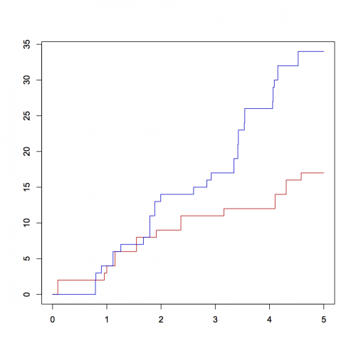
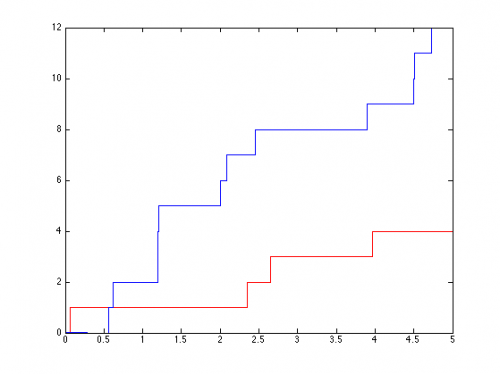

[](http://quantlet.de/)

## [](http://quantlet.de/) **simNHPP_** [](http://quantlet.de/)

```yaml

Name of QuantLet: simNHPP_

Published in: Statistical Tools for Finance and Insurance

Description: 'Generates non-homogeneous Poisson process and plot 2 trajectories from non-homogeneous processes.'

Keywords: poisson, Poisson process, risk, risk management, stochastic-process, stochastic

See also: 'BondCoupon, BondCoupon, BondOnlyCoupon, BondOnlyCoupon, BondZeroCoupon, STFcat02, STFcat04, STFcat04, STFcat05, STFcat05, STFcat06, STFcat06, STFcat07, STFcat07, STFcat08, STFcat08, STFcat09, STFcat09, quantilelines, simHPP, simNHPPALP, simNHPPALP'

Author: Awdesch Melzer

Submitted: Tue, August 06 2013 by Awdesch Melzer

Input: 'lamda: scalar, intensity function, sine function (lambda=0) linear function (lambda=1) or sine square function (lambda=2)
        parlambda: n x 1 vector, parameters of the intensity function lambda (n = 2 for lambda = 1, n = 3 otherwise)
        N: scalar, number of trajectories
        T: scalar, time horizon'

Output: 'y: (2*max+2) x N x 2 array, generated process: max is the maximum number of jumps for all generated trajectories'

Example: 'Show two trajectories of non-homogeneous Poisson process: y = simNHPP(lambda,parlambda,T,N)
          R:
          y1 = simNHPP(0,c(1,1,0),5,1)
          y2 = simNHPP(1,c(1,1),5,1)
          plot(y1[,1],y1[,2],type="l",col="red3",ylim=c(min(y1[,2],y2[,2]),max(y1[,2],y2[,2])),ylab="",xlab="")
          lines(y2[,1],y2[,2],type="l",col="blue3")
          MatLab:
          y1 = simNHPP(0,[1,1,0],5,1);
          y2 = simNHPP(1,[1,1],5,1);
          plot(y1(:,:,1),y1(:,:,2),"r-")
          ylim([min(min(y1(:,:,2)),min(y2(:,:,2))),max(max(y1(:,:,2)),max(y2(:,:,2)))])
          line(y2(:,:,1),y2(:,:,2))'

```





### R Code
```r

# ---------------------------------------------------------------------
# Book         STF
# ---------------------------------------------------------------------
# See also:    simHPP
# ---------------------------------------------------------------------
# Quantlet:    simNHPP
# ---------------------------------------------------------------------
# Description: simNHPP generates non-homogeneous Poisson process.
# ---------------------------------------------------------------------
# Usage:       y = simNHPP(lambda,parlambda,T,N)
# ---------------------------------------------------------------------
# Input:     
# Parameter:   lambda
# Definition:  scalar, intensity function, sine function (lambda=0)
#              linear function (lambda=1) or sine square function (lambda=2)
# Parameter:   parlambda
# Definition:  n x 1 vector, parameters of the intensity function lambda
#              (n = 2 for lambda = 1, n = 3 otherwise)
# Parameter:   T
# Definition:  scalar, time horizon
# Parameter:   N
# Definition:  scalar, number of trajectories
# ---------------------------------------------------------------------
# Output:      
# Parameter:   y
# Definition:  2*max+2 x N x 2 array, generated process - max is the
#              maximum number of jumps for all generated trajectories 
# ---------------------------------------------------------------------
# Example:     
#              y1 = simNHPP(0,c(1,1,0),5,1)
#              y2 = simNHPP(1,c(1,1),5,1)
#              plot(y1[,1],y1[,2],type="l",col="red3",ylim=c(min(y1[,2],y2[,2]),max(y1[,2],y2[,2])),ylab="",xlab="")
#              lines(y2[,1],y2[,2],type="l",col="blue3")
# ---------------------------------------------------------------------
# Result:      Show two trajectories of non-homogeneous Poisson process
# ---------------------------------------------------------------------
# Keywords:    Poisson process, risk process
# ---------------------------------------------------------------------
# Reference:   K. Burnecki, R.Weron (2004) "Modeling of the risk process",
#	           in "Statistical Tools for Finance and Insurance", 
#              eds. P. Cizek, W. Härdle, R. Weron, Springer. 
# ---------------------------------------------------------------------
# Author:      Awdesch Melzer 20130628
# ---------------------------------------------------------------------


simNHPP = function(lambda,parlambda,T,N){
  	
    # SIMNHPP Non-homogeneous Poisson process.
    # ---------------------------------------------------------------------
    #       Y = SIMNHPP(lambda,parlambda,T,N) generates N trajectories of the
    #       non-homogeneous Poisson process with intensity specified by LAMBDA
    #       (0 - sine function, 1 - linear function, 2 - sine square function)
    #       with paramters in PARLAMBDA. T is the time horizon. The function
    #       usues thining method.
    # ---------------------------------------------------------------------
    
    a = parlambda[1]
    b = parlambda[2]
    if (lambda==0){
        d = parlambda[3]
        JM = simHPP(a+b,T,N)
    } else if(lambda==1){
        JM = simHPP(a+b*T,T,N)
    } else if (lambda==2){
        d = parlambda[3]
        JM = simHPP(a+b*T,T,N)
	}
	rjm = nrow(JM)
    yy = array(0,c(rjm,N,2))
    yy[,,1]= matrix(T,nrow=rjm,ncol=N)
    
    i=1
    maxEN=0
    while(i<=N){
        pom = JM[,i,1][JM[,i,1]<T]
        pom = pom[2*(1:(length(pom)/2))]
        R = runif(NROW(pom))
        if (lambda==0){
            lambdat = (a+b*sin(2*pi*(pom+d)))/(a+b)
        } else {
            if (lambda==1){
                lambdat = (a+b*pom)/(a+b*T)
            } else {
                if (lambda==2){
                    lambdat = (a+b*sin(2*pi*(pom+d))^2)/(a+b)
                }}}
        pom = pom[R<lambdat]
        EN = NROW(pom)
        maxEN = max(maxEN,EN)
        yy[1:(2*EN+1),i,1] = c(0,rep(pom,each=2))
        yy[2:(2*EN),i,2] = c(floor((1:(2*EN-1))/2))
        yy[(2*EN+1):rjm,i,2] = matrix(EN,nrow=rjm-2*EN,ncol=1)
        i=i+1
    }
    yy = yy[1:(2*maxEN+2),,]
    return(yy)
}


```

automatically created on 2018-05-28

### MATLAB Code
```matlab

function [y] = simNHPP(lambda,parlambda,T,N)
  	
% SIMNHPP Non-homogeneous Poisson process.
%       Y = SIMNHPP(lambda,parlambda,T,N) generates N trajectories of the
%       non-homogeneous Poisson process with intensity specified by LAMBDA
%       (0 - sine function, 1 - linear function, 2 - sine square function)
%       with paramters in PARLAMBDA. T is the time horizon. The function
%       usues thining method.

  a = parlambda(1);
  b = parlambda(2);
  if (a<=0)
      error('simNHPP: a must be a positive real number');
  end
  if (a+b<= 0)
      error('simNHPP: b does not fulfill special condition');
  end
  if (T <= 0)
      error('simNHPP: T must be a positive real number');
  end
  if (lambda == 0)
        c  = parlambda(3);
        JM = simHPP(a+b,T,N);
  elseif( lambda==1)
        JM = simHPP(a+b*T,T,N);
  elseif(lambda==2)
        c  = parlambda(3);
        JM = simHPP(a+b,T,N);
  end
  
  rjm      = size(JM,1);
  y        = ones(rjm,N,2);
  y(:,:,1) = T*y(:,:,1);
  y(:,:,2) = 0*y(:,:,2);
  maxEN    = 0;
  i        = 1;
  while(i<=N)
  	JMind = find(JM(:,i,1)<T);
    pom   = JM(JMind,i,1);
    poml  = length(pom);
    pom   = pom(2*(1:(poml-1)/2));
    U     = unifrnd(0,1,length(pom),1);
    
    if(lambda == 0)
            lambdat = (a+b*sin(2*pi*(pom+c)))/(a+b);
    elseif(lambda == 1)
            lambdat = (a+b*pom)/(a+b*T);
    elseif(lambda == 2)
            lambdat = (a+b*sin(2*pi*(pom+c)).^2)/(a+b);
    end
    pomind            = find(U<lambdat);
    pom               = pom(pomind);
    EN                = length(pom);
    maxEN             = max([maxEN,EN]);
    y(1:(2*EN+1),i,1) = [0;pom(ceil((1:(2*EN))/2))];
    y(2:(2*EN),i,2)   = floor((1:(2*EN-1))/2)';
    y((2*EN+1):rjm,i,2) = EN*ones((rjm-2*EN),1);
    i               = i+1;
  end
  y = y(1:(2*maxEN+2),:,:);
  
end
```

automatically created on 2018-05-28