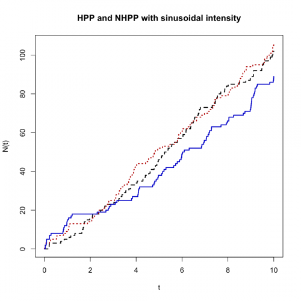
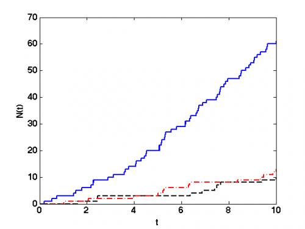

[](http://quantlet.de/)

## [](http://quantlet.de/) **STFloss01** [](http://quantlet.de/)

```yaml

Name of QuantLet: STFloss01

Published in: Statistical Tools for Finance and Insurance

Description: 'Plots sample trajectories of a NHPP with linear intensity lambda(t)=a+b*t (figure 1) and sample trajectories of a NHPP with periodic intensity lambda(t)=a+b*cos(2*pi*t). The black processes are HPP with b=0.'

Keywords: loss function, Poisson process, random, simulation, graphical representation, visualization

See also: 'Paretopdf, STFloss02, STFloss03, STFloss04, STFloss05, STFloss06, STFloss07, STFloss08, STFloss09, mef , simHPP, simNHPP'

Author: Joanna Janczura, Awdesch Melzer

Submitted: Tue, October 09 2012 by Dedy Dwi Prastyo

Example: 'Produces these plots: plot with linear intensity, plot with sinusoidal intensity.'


```







### R Code
```r

# clear variables and close windows
rm(list=ls(all=TRUE))
graphics.off()


simHPP = function(lambda,T,N){
# SIMHPP Homogeneous Poisson process.
#       Y = SIMHPP(lambda,T,N) generates N trajectories of the
#       homogeneous Poisson process with intensity LAMBDA. T is the time
#       horizon. 

  if (lambda <= 0){
    message('simHPP: Lambda must be a positive real number')
  }
  if (T <= 0){
    message('simHPP: T must be a positive real number')
  }
  EN = rpois(N,lambda*T)
max(EN) 
  y=T*matrix(1,max(EN)+1,N)
  i=1
  while(i<=N){
      y[1,i]=0;
    if (EN[i]>0){
      y[2:EN[i]+1,i]=sort(T*runif(EN[i]-1,0,1)); 
    }
    
    i=i+1;
    }
  return(y)
  }
  
  
simNHPP = function(lambda,parlambda,T,N){
# SIMNHPP Non-homogeneous Poisson process.
#       Y = SIMNHPP(lambda,parlambda,T,N) generates N trajectories of the
#       non-homogeneous Poisson process with intensity specified by LAMBDA
#       (0 - sine function, 1 - linear function, 2 - sine square function)
#       with paramters in PARLAMBDA. T is the time horizon. The function
#       usues thining method.

  a = parlambda[1]
  b = parlambda[2]
  if (a<=0){
    message('simNHPP: a must be a positive real number')
  }
  if (a+b<= 0){
    message('simNHPP: b does not fulfill special condition');
  }
  if (T <= 0){
    message('simNHPP: T must be a positive real number');
  }
  
  		if(lambda==0){
  			c = parlambda[3]
  		JM = simHPP(a+b,T,N)
  		}else if(lambda==1){
  		JM = simHPP(a+b*T,T,N)
  		}else if(lambda==2){
  			c = parlambda[3]
  		JM = simHPP(a+b,T,N)
      	}
  
      
  n = dim(JM)[1]
  m = dim(JM)[2]
  i = 1
  y = matrix(T,n,N)
  while(i<=N){
    pom = subset(JM,JM[,i]<T)
    end = length(pom)
    pom = pom[2:end]
    U = runif(length(pom),0,1);
    
    if(lambda==0){ 
            lambdat = (a+b*sin(2*pi*(pom+c)))/(a+b)
        }else if(lambda==1){
            lambdat = (a+b*pom)/(a+b*T)
        }else if(lambda==2){
            lambdat = (a+b*sin(2*pi*(pom+c))^2)/(a+b)
            }
    
        
    pom  = subset(pom,U<lambdat)
    EN = length(pom)
    y[1,i] = 0
    y[2:(EN+1),i] = pom
    i=i+1
  }
	return(y)
}
  
############################################
############# main calculation #############
############################################

# Pseudo random numbers
set.seed(100)

# linear intensity
z=10;
y1 = simNHPP(1,c(1,0),z,1);
n1 = length(subset(y1,y1<z));

y2 = simNHPP(1,c(1,0.1),z,1);
n2 = length(subset(y2,y2<z));

y3 = simNHPP(1,c(1,1),z,1);
n3 = length(subset(y3,y3<z));

# plot
plot(c(y1[1:n1],z),c(0:n1),type="s", lty=2, col="black", lwd=2,xlim=c(0,max(y1,y2,y3)),ylim=c(0,max(n1,n2,n3)),xlab="t", ylab="N(t)", main="HPP and NHPP with linear intensity")
lines(c(y2[1:n2],z),c(0:n2),type="s",lty=3, col="red3",lwd=2)
lines(c(y3[1:n3],z),c(0:n3),type="s",col="blue3", lty=1,lwd=2)

# sinusoidal intensity

y1 = simNHPP(0,c(10,0,1/4),z,1)
n1 = length(subset(y1,y1<z))

y2 = simNHPP(0,c(10,1,1/4),z,1)
n2 = length(subset(y2,y2<z))

y3 = simNHPP(0,c(10,10,1/4),z,1);
n3 = length(subset(y3,y3<z));

# plot
dev.new()
plot(c(y1[1:n1],z),c(0:n1),type="s", lty=2, col="black", lwd=2,xlim=c(0,max(y1,y2,y3)),ylim=c(0,max(n1,n2,n3)),xlab="t", ylab="N(t)", main="HPP and NHPP with sinusoidal intensity")
lines(c(y2[1:n2],z),c(0:n2),type="s",lty=3, col="red3",lwd=2)
lines(c(y3[1:n3],z),c(0:n3),type="s",col="blue3", lty=1,lwd=2)

```

automatically created on 2018-05-28

### MATLAB Code
```matlab

% clear variables and close windows
clear all
close all
clc

% Pseudo random numbers
RandStream.setGlobalStream(RandStream('mt19937ar','seed',2012));

% linear intensity
T=10;
y1=simNHPP(1,[1,0],T,1);
n1=length(find(y1<T));

y2=simNHPP(1,[1,0.1],T,1);
n2=length(find(y2<T));

y3=simNHPP(1,[1,1],T,1);
n3=length(find(y3<T));

stairs([y1(1:n1);T],(0:n1),'--k','LineWidth',2);
hold on
stairs([y2(1:n2);T],(0:n2),'-.r','LineWidth',2);
stairs([y3(1:n3);T],(0:n3),'LineWidth',2);
xlabel('t','FontSize',16,'FontWeight','Bold');
ylabel('N(t)','FontSize',16,'FontWeight','Bold');
set(gca,'LineWidth',1.6,'FontSize',16,'FontWeight','Bold')
box on

% sinusoidal intensity

y1=simNHPP(0,[10,0,1/4],T,1);
n1=length(find(y1<T));

y2=simNHPP(0,[10,1,1/4],T,1);
n2=length(find(y2<T));

y3=simNHPP(0,[10,10,1/4],T,1);
n3=length(find(y3<T));

figure
stairs([y1(1:n1);T],(0:n1),'--k','LineWidth',2);
hold on
stairs([y2(1:n2);T],(0:n2),'-.r','LineWidth',2);
stairs([y3(1:n3);T],(0:n3),'LineWidth',2);
xlabel('t','FontSize',16,'FontWeight','Bold');
ylabel('N(t)','FontSize',16,'FontWeight','Bold');
set(gca,'LineWidth',1.6,'FontSize',16,'FontWeight','Bold')
box on

```

automatically created on 2018-05-28