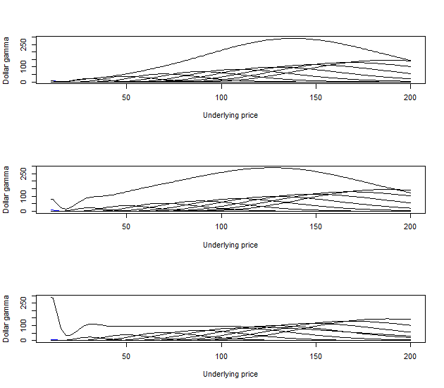

[](http://quantlet.de/)

## [](http://quantlet.de/) **STF2dollargamma2D** [](http://quantlet.de/)

```yaml

Name of QuantLet: STF2dollargamma2D

Published in: Statistical Tools for Finance and Insurance

Description: 'Calculates the variance vega of equally weighted options" portfolio, weighted by 1/K and by 1/K^2.'

See also: STF2daxvswap, STF2dollargamma3D, STF2vswapstrike

Author: Elena Silyakova, Gregoire Njacheun, Awdesch Melzer

Keywords: gamma, vega, option, portfolio, volatility

Submitted: Thu, May 10 2012 by Dedy Dwi Prastyo

Input: 'n- number of strikes in portfolio
	s2- the highest strike of options" portfolio
	s1- the lowest strike of options" portfolio
	tau- maturity of a swap'

Output: '- 2D plot of individual dollar gammas and portfolio dollar gamma for each weighting scheme'

Example: 'For STF2dollargamma2D(s1=10, s2=200, n=10, tau=1) a plot plot of individual dollar gammas and portfolio dollar gamma for each weighting scheme'


```




### R Code
```r

# ---------------------------------------------------------------------
# Book:         STF2
# ---------------------------------------------------------------------
# Quantlet:     STF2dollargamma2D
# ---------------------------------------------------------------------
# Description:  STF2dollargamma calculates the variance vega of equally
#               weighted options' portfolio, weighted by 1/K and by 1/K^2
# ---------------------------------------------------------------------
# Usage:        STF2dollargamma2D
# ---------------------------------------------------------------------
# Inputs:       s1 - the lowest strike of options'portfolio
#               s2 - the highest strike of options'portfolio
#               n - number of strike
#               tau - maturity of a swap;
# ---------------------------------------------------------------------
# Output:       2D plot of individual dollar gammas and portfolio dollar
#               gamma for each weighting scheme
# ---------------------------------------------------------------------
# Example:      For STF2dollargamma2D(s1=10, s2=200, n=10, tau=1) a plot
#               plot of individual dollar gammas and portfolio dollar
#               gamma for each weighting scheme 
# ---------------------------------------------------------------------
# Author:       Elena Silyakova, Gregoire Njacheun, Awdesch Melzer
#               20120510
# ---------------------------------------------------------------------

rm(list=ls(all=TRUE))
graphics.off()

STF2dollargamma2D = function(s1="lower bond",s2="upper bond",n="number of strike",tau="matrity of swap")
{
 r = 0 # zero interest rate
 v = 0.25 # implied volatility
 k = seq(s1,s2, by=-(s1-s2-1)/n)
 range = s2-s1
 dollargamma = NULL
 dollargammak = NULL  
 dollargammak2 = NULL
 tv = NULL
 tv1 = NULL
 tv2 = NULL

 for(j in 1:n)  #produces gamma "curves" for each strike range
 {
  s_min = max(s1,(k[j]-range))
  s_max = min(s2,(k[j]+range))
  s = seq(s_min,s_max,by=1)

  for(i in 1:length(s)) # produces individual gamma for a given strike but different underlying price 
  {
   d1 = (log(s[i]/k[j])+(r+v^2/2)*tau)/(v*tau^0.5)
   tv[i] = (dnorm(d1)*s[i])/(2*v*tau^0.5)
   tv1[i] = (dnorm(d1)*s[i])/(2*k[j]*v*tau^0.5)
   tv2[i] = (dnorm(d1)*s[i])/(2*k[j]^2*v*tau^0.5) 
  }
   dollargamma = rbind(dollargamma,tv)
   dollargammak = rbind(dollargammak,tv1)  
   dollargammak2 = rbind(dollargammak2,tv2)
 }
 
 # calculating dollar gamma of the sum
 ###########################################
 
 cumdollargamma = dollargamma[1,]
 
 for(b in 2:(n-1)) cumdollargamma = cumdollargamma+dollargamma[b,]
 
 cumdollargamma = 2*max(dollargamma)*cumdollargamma/max(cumdollargamma)
 cumdollargammak = dollargammak[1,]
 
 for(b in 2:(n-1)) cumdollargammak = cumdollargammak+dollargammak[b,]
 
 cumdollargammak = 2*max(dollargamma)*cumdollargammak/max(cumdollargammak)
 cumdollargammak2 = dollargammak2[1,]

 for(b in 2:(n-1)) cumdollargammak2 = cumdollargammak2+dollargammak2[b,]

 cumdollargammak2 = 2*max(dollargamma)*cumdollargammak2/max(cumdollargammak2)

##############################
# plotting

 par(mfrow=c(3,1))


 
 x = seq(s1,s2,by=1)
 plot(x,dollargamma[1,],xlim=c(s1,s2), ylim=c(0,max(cumdollargamma)),col="blue",type="l",xlab="Underlying price", ylab="Dollar gamma")
 
 for (z in 2:n)
 {lines(x,dollargamma[z,],xlim=c(s1,s2), ylim=c(0,max(cumdollargamma)),type="l",xlab="Underlying price", ylab="Dollar gamma")
 } 
 lines(x,cumdollargamma,xlim=c(s1,s2), ylim=c(0,max(cumdollargamma)),type="l",xlab="Underlying price", ylab="Dollar gamma")


 
 x = seq(s1,s2,by=1)
 plot(x,dollargamma[1,],xlim=c(s1,s2), ylim=c(0,max(cumdollargammak)),col="blue",type="l",xlab="Underlying price", ylab="Dollar gamma")
 
 for (z in 2:n)
 {lines(x,dollargamma[z,],xlim=c(s1,s2), ylim=c(0,max(cumdollargammak)),type="l",xlab="Underlying price", ylab="Dollar gamma")
 } 
 lines(x,cumdollargammak,xlim=c(s1,s2), ylim=c(0,max(cumdollargammak)),type="l",xlab="Underlying price", ylab="Dollar gamma")


 
 x = seq(s1,s2,by=1)
 plot(x,dollargamma[1,],xlim=c(s1,s2), ylim=c(0,max(cumdollargammak2)),col="blue",type="l",xlab="Underlying price", ylab="Dollar gamma")
 
 for (z in 2:n)
 {lines(x,dollargamma[z,],xlim=c(s1,s2), ylim=c(0,max(cumdollargammak2)),type="l",xlab="Underlying price", ylab="Dollar gamma")
 } 
 lines(x,cumdollargammak2,xlim=c(s1,s2), ylim=c(0,max(cumdollargammak2)),type="l",xlab="Underlying price", ylab="Dollar gamma")


}

STF2dollargamma2D(10,200,10,1)
```

automatically created on 2018-05-28

### MATLAB Code
```matlab

close all
disp('Please input the lowest and the highest strike of options portfolio as: [10,200]') ;
disp(' ') ;
para=input('Options strike range [lower bound, upper bound]=');
while length(para) < 2
  disp('Not enough input arguments. Please input in 1*2 vector form like [10,200] or [10,200]');
  para=input('Options strike range [lower bound, upper bound]=');
end
s1=para(1);
s2=para(2);
disp(' ') ;

disp(' ') ;
disp('Please input the number of strikes in portfolio (e.g. 10)') ;
disp(' ') ;
para=input('Number of strikes =');
n=para;


disp(' ') ;
disp('Please input the maturity of a swap (e.g. 1)') ;
disp(' ') ;
para=input('Maturity =');
tau=para;


% main computation
r=0   ;              % interest rate
v=0.25 ;             % volatility

k=s1:-(s1-s2-1)/n:s2;
range=s2-s1;

for j=1:n %produces gamma "curves" for each strike range    

s_min=max(s1,(k(j)-range));
s_max=min(s2,(k(j)+range));
s=s_min:1:s_max;


for i=1:length(s)  %produces individual gammas for a given strike but different underlying price 
d1=(log(s(i)/k(j))+(r+v^2/2)*tau)/(v*tau^0.5);
dollargamma(i,j)=(normpdf(d1)*s(i))/(2*v*tau^0.5);
dollargammak(i,j)=(normpdf(d1)*s(i))/(2*k(j)*v*tau^0.5);
dollargammak2(i,j)=(normpdf(d1)*s(i))/(2*k(j)^2*v*tau^0.5);

i=i+1;
end

j=j+1;
end

%calculating dollar gamma of the sum
%%%%%%%%%%%%%%%%%%%%%%%%%%%%%%%%%%%%%%%%

cumdollargamma=dollargamma(:,1);
for b=2:n-1
cumdollargamma=cumdollargamma+dollargamma(:,b);
end
cumdollargamma=2*max(max(dollargamma))*cumdollargamma/max(cumdollargamma);


cumdollargammak=dollargammak(:,1);
for b=2:n-1
cumdollargammak=cumdollargammak+dollargammak(:,b);
end
cumdollargammak=2*max(max(dollargamma))*cumdollargammak/max(cumdollargammak);


cumdollargammak2=dollargammak2(:,1);
for b=2:n-1
cumdollargammak2=cumdollargammak2+dollargammak2(:,b);
end
cumdollargammak2=2*max(max(dollargamma))*cumdollargammak2/max(cumdollargammak2);


%%%%%%%%%%%%%%%%%%%%%%%%%%%%%%%%%%%%%%%%

%plotting


subplot(3,1,1);
x = s1:1:s2;

axis([s1 s2 0 max(cumdollargamma)])
%title('Dollargamma of the options portfolio')
xlabel('Underlying price')
ylabel('Dollar gamma')
hold on


for z=1:n
plot(x,dollargamma(:,z), 'color',[0 0 0],'LineWidth',1)
hold on
end
  
plot(x,cumdollargamma, 'color',[0 0 0],'LineWidth',2)


subplot(3,1,2);

x = s1:1:s2;

axis([s1 s2 0 max(cumdollargammak)])
%title('Dollargamma of the options portfolio')
xlabel('Underlying price')
ylabel('Dollar gamma')
hold on


for z=1:n
plot(x,dollargamma(:,z), 'color',[0 0 0],'LineWidth',1)
hold on
end
    
    
plot(x,cumdollargammak, 'color',[0 0 0],'LineWidth',2)


subplot(3,1,3);

x = s1:1:s2;

axis([s1 s2 0 max(cumdollargammak2)])
%title('Dollargamma of the options portfolio')
xlabel('Underlying price')
ylabel('Dollar gamma')
hold on


for z=1:n
plot(x,dollargamma(:,z), 'color',[0 0 0],'LineWidth',1)
hold on
end

plot(x,cumdollargammak2, 'color',[0 0 0],'LineWidth',2)


hold off


clear b cumdollargamma cumdollargammak cumdollargammak2 d1 dollargamma dollargammak dollargammak2 i j k n para r range s s1 s2 s_max s_min tau v x z


```

automatically created on 2018-05-28